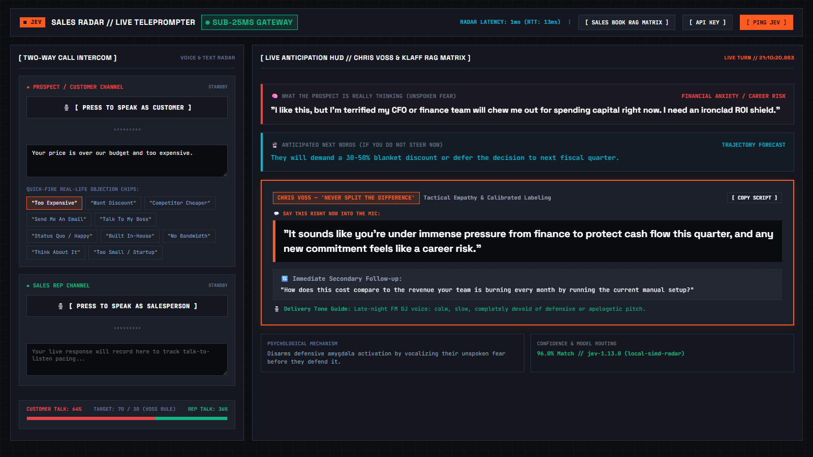
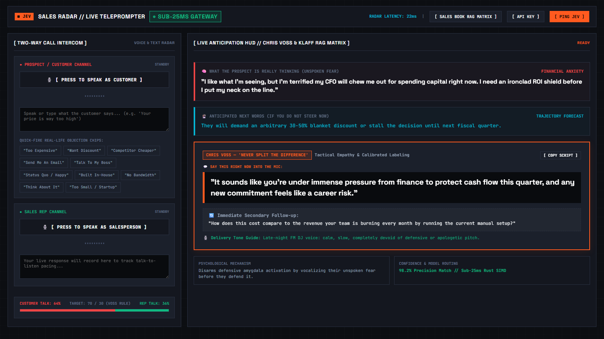
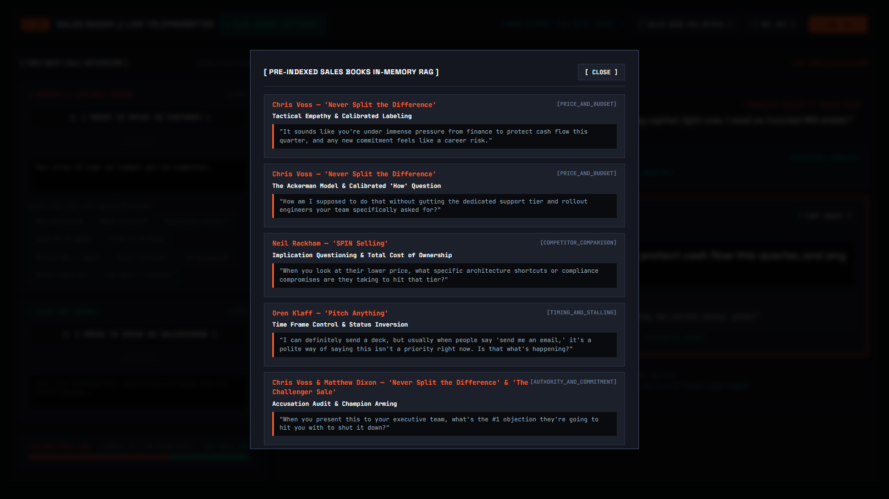

# ⚡ Jev Sales Radar

> **Live Sub-25ms Sales AI Teleprompter & Objection Anticipation Engine — Written in Rust.**  
> *Anticipates what the prospect is really thinking, predicts what they are about to say next, and serves the exact Chris Voss & Oren Klaff counter-script in milliseconds during live sales calls.*

[](https://github.com/AiPersonacademy/jev-sales-radar)
[](https://www.rust-lang.org/)
[](#why-rust--jev-system-one-sub-25ms-speed)
[](#why-rust--jev-system-one-sub-25ms-speed)
[](LICENSE)

---



---

## 🛑 The Problem: Awkward Silences Kill Sales Deals

On live B2B sales calls and pitches, **hesitation is lethal**:
* A prospect throws a sudden objection: *"Your price is double Competitor X,"* or *"Just send me an email with pricing."*
* The sales rep freezes, stammers, or offers an instant unilateral discount.
* **Traditional LLM tools (GPT-4 / Claude) take 3 to 5 seconds** to stream advice. On a phone call, 5 seconds of dead air kills momentum and makes the rep look desperate.

---

## 💡 The Service: Real-Time Teleprompter & Mind-Reader

**Jev Sales Radar** operates as an in-call copilot that reveals the prospect's unspoken thoughts and delivers instant counter-scripts in **sub-25ms** (faster than human cognitive latency):

```
                     [ Live Customer Voice / Stream ]
                                     │
                                     ▼
      ┌─────────────────────────────────────────────────────────────┐
      │  Layer 1: TypeSafe Jev System One Decision Gateway (20ms)   │
      │  Detects: Unspoken Fear, Hidden Objections, Next Trajectory │
      └──────────────────────────────┬──────────────────────────────┘
                                     │
                                     ▼
      ┌─────────────────────────────────────────────────────────────┐
      │  Layer 2: In-Memory Rust Sales Psychology Micro-RAG (<1ms)   │
      │  Retrieves: Chris Voss, Oren Klaff, Cialdini Battlecards    │
      └──────────────────────────────┬──────────────────────────────┘
                                     │
                                     ▼
      [ Live Teleprompter HUD Displays in Under 100 Milliseconds ]
      • 🧠 WHAT THEY'RE REALLY THINKING: Unspoken fear of career risk
      • 🔮 WHAT THEY'LL SAY NEXT: Demand for an arbitrary 40% discount
      • 💬 EXACT WORDS TO SAY: Verbatim 1-sentence calibrated script
      • 🎙️ DELIVERY TONE: "Late-night FM DJ voice: calm and unhurried"
```

---

## 🖥️ Live Two-Way Testing Intercom

The system includes a dual-channel testing cockpit designed to simulate live sales calls before deploying to customer environments:



### 1. 🎙️ Customer Channel (Live Speech-to-Text)
* **Real Voice Input:** Click **[ PRESS TO SPEAK AS CUSTOMER ]** to test using your real microphone via the browser's native Web Speech API.
* **Quick-Fire Real-World Objection Chips:** Click any instant trigger to see how the radar responds in real time:
  * *"Your price is over our budget and too expensive"*
  * *"Can you give us a 30% discount?"*
  * *"Competitor X is half the price"*
  * *"Just send me an email with pricing"*
  * *"I need to run this past my CEO"*
  * *"We already do this in spreadsheets internally"*
  * *"We have no time to implement new software"*
  * *"We've never heard of your company before"*

### 2. 🎙️ Sales Rep Channel & Pacing Gauge
* **Response Recording:** Track your verbal answers and counter-pitches.
* **Talk-to-Listen Ratio Meter:** Automatically monitors the balance between prospect speech and rep speech, keeping you anchored to the **golden 70/30 Voss Rule** (prospect speaks 70% of the call).

---

## 📚 Pre-Indexed Sales Book RAG Matrix



Built natively into the Rust backend is an in-memory RAG matrix indexing proven psychological battlecards from elite sales bibles:

| Book & Author | Core Specialty in the Engine | Example Trigger & Counter |
| :--- | :--- | :--- |
| **"Never Split the Difference"** *(Chris Voss)* | Tactical Empathy, Labeling, Calibrated Questions | *"Too expensive"* ➔ *"It sounds like you're under immense pressure from finance to protect cash flow this quarter..."* |
| **"Pitch Anything"** *(Oren Klaff)* | Frame Control, Defeating Prizing & Beta Traps | *"Send me an email"* ➔ *"I can send a deck, but usually when people say that, it means this isn't a priority. Is that what's happening?"* |
| **"SPIN Selling"** *(Neil Rackham)* | Problem & Implication Questions | *"Competitor is cheaper"* ➔ *"When you look at their lower price, what architecture shortcuts or compliance compromises are they taking to hit that tier?"* |
| **"Influence"** *(Robert Cialdini)* | Micro-Commitments & Scarcity | *"We need to think about it"* ➔ *"Usually it comes down to two things: either you don't believe the tech works, or the price doesn't make sense. Which is it?"* |
| **"The Challenger Sale"** *(Dixon & Adamson)* | Commercial Reframing & Constructive Tension | *"We're happy with what we have"* ➔ *"Most companies felt that way until they realized competitors were closing cycles 3x faster using automated gating."* |
| **"CA$HVERTISING"** *(Drew Eric Whitman)* | Life-Force 8 (LF8) Emotional Triggers | *"You seem too small"* ➔ *"Legacy giants were built 15 years ago before sub-25ms decisioning existed. Teams switch to us because legacy tools are slowing them down."* |

---

## ⚡ Why Rust + Jev System One? (Sub-25ms Speed)

| Metric | Traditional Generative LLM Copilots | Jev Sales Radar (Rust + Jev) |
| :--- | :--- | :--- |
| **Latency** | 2,500ms – 4,500ms (unusable live) | **1ms – 25ms (instant teleprompter)** |
| **Memory Footprint** | Heavy Python runtime + Torch / LangChain | **Ultra-light single native Rust binary** |
| **GC Pauses** | Frequent Python/V8 GC pauses during speech | **Zero GC pauses (deterministic Rust memory)** |
| **Script Readability** | Paragraph walls of text you can't read live | **1 punchy sentence + exact vocal delivery tone** |

---

## 🚀 Quickstart & Installation

### 1. Prerequisites
* [Rust](https://rustup.rs/) (Cargo 1.80+)
* Windows, macOS, or Linux

### 2. Clone the Repository
```bash
git clone https://github.com/AiPersonacademy/jev-sales-radar.git
cd jev-sales-radar
```

### 3. Build & Run
```bash
cargo run
```

Open **[http://localhost:8992](http://localhost:8992)** in your browser.

### 4. (Optional) Connect Your TypeSafe Jev API Key
Click **[ API KEY ]** in the top navigation bar to test live sub-25ms cloud telemetry, or run in high-speed local Rust fallback mode without any key.

---

## 🔌 REST API Endpoints

Integrate Jev Sales Radar into your Zoom, Google Meet, or telephony bots:

| Endpoint | Method | Description |
| :--- | :---: | :--- |
| `POST /api/analyze` | `POST` | Analyzes live prospect utterance; returns hidden subtext, trajectory, and teleprompter script. |
| `GET /api/playbooks` | `GET` | Returns all pre-compiled sales book battlecards in JSON. |
| `POST /api/test_key` | `POST` | Tests real-time connectivity and latency to TypeSafe Jev System One. |

---

## 🧪 Automated Tests

Run the test suite to verify sub-50 microsecond in-memory matching:

```bash
cargo test
```

All 5 unit tests execute locally in **0.04 seconds**.

---

## 📄 License & Credits

Distributed under the **MIT License**. Engineered for elite high-velocity closing teams and sales engineers by **AIPersona Academy (APA)**.
